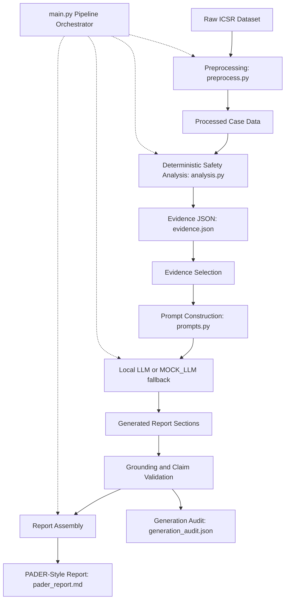

# Architecture Diagram

```mermaid
flowchart TD
  A["Raw ICSR Dataset"] --> B["Preprocessing: preprocess.py"]
  B --> C["Processed Case Data"]
  C --> D["Deterministic Safety Analysis: analysis.py"]
  D --> E["Evidence JSON: evidence.json"]
  E --> F["Evidence Selection"]
  F --> G["Prompt Construction: prompts.py"]
  G --> H["Local LLM or MOCK_LLM fallback"]
  H --> I["Generated Report Sections"]
  I --> J["Grounding and Claim Validation"]
  J --> K["Report Assembly"]
  K --> L["PADER-Style Report: pader_report.md"]
  J --> M["Generation Audit: generation_audit.json"]
  N["main.py Pipeline Orchestrator"] -.-> B
  N -.-> D
  N -.-> H
  N -.-> K
```

Python owns numerical truth. The language model owns prose. Validation and human review own acceptance.
